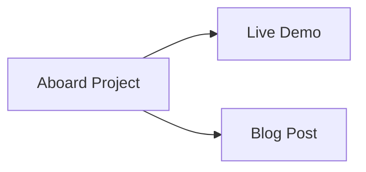
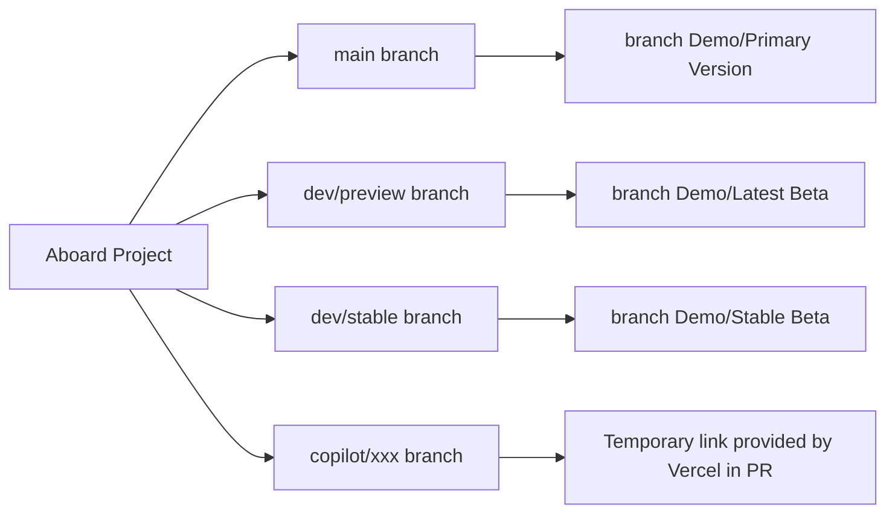

# Aboard

<div align="center">

**[简体中文](../README.md)** | **[繁體中文](README.zh-TW.md)** | **[English](README.en.md)**

</div>

> A minimalist and elegant web-based whiteboard application, designed for teaching and presentations | 𝓙𝓾𝓼𝓽 𝓪 𝓫𝓸𝓪𝓻𝓭.

# Abstract

The **AI-Agent** project by a developing freshman, a first-year college student, aims to create a whiteboard with **simple functionality, easy deployment, and an extremely intuitive user experience**, primarily designed for **interactive whiteboard teaching in domestic middle and high schools**.

Due to my limited practical development experience, this project heavily utilizes AI-Agent technology (i.e., leveraging GitHub's Agent functionality to assist in development and efficiently advance feature implementation). As a result, the code may lack a **"human touch"** and could contain **numerous unreasonable bugs** or **development approaches**. I kindly ask for your understanding and gentle feedback.

You can quickly experience this project through the **Demo link** below, or visit my blog to learn more about the background and motivation behind it.

**If you find this project valuable, please give it a star🌟—--college students would greatly appreciate it!**



## Current branches and versions



[](LICENSE)

## ✨ Key Features

### 🎨 Diverse Drawing Tools
- **Multiple Pen Types**: Normal pen, pencil, ballpoint, fountain pen, brush - catering to different writing needs
- **Smart Eraser**: Supports circular and square shapes, adjustable size (10-50px)
- **Rich Color Selection**: 8 preset common colors + custom color picker
- **Flexible Stroke Width**: Adjustable pen thickness from 1-50px

### 📐 Professional Background Patterns
- **Multiple Teaching Backgrounds**: Blank, dots, grid, Tianzige (Chinese grid), English 4-line, staff, coordinate system
- **Custom Background**: Support uploading images as backgrounds with adjustable size and position
- **Background Styles**: 8 preset background colors + custom colors, adjustable transparency and pattern intensity

### 📄 Pagination Canvas Mode
- **Pagination Mode**: Multi-page management, perfect for classroom presentations and teaching
  - Preset sizes: A4, A3, B5 (landscape/portrait), 16:9, 4:3 widescreen
  - Custom sizes: Freely set canvas width, height, and aspect ratio
  - Auto-centered canvas: Ensures canvas is centered in browser window with equal margins on all sides

### 🎯 Smart Interactive Experience
- **Selection Tool**: Select and manipulate strokes and images on canvas, supports copy and delete
- **Move Canvas**: Drag tool or hold Shift key to drag canvas
- **Smart Zoom**: Ctrl+scroll to zoom canvas, zoom center follows mouse position, supports 50%-Unlimited zoom range
- **Initial Canvas Size**: On first load or refresh, canvas automatically adjusts to 80% of browser window size
- **Undo/Redo**: Supports up to 50 history steps (Ctrl+Z / Ctrl+Y)
- **Fullscreen Mode**: Focus on creation with immersive experience (F11)
- **Refresh Protection**: Warning prompt when refreshing page to prevent accidental content loss

### ⏱️ Timer Function
- **Stopwatch Mode**: Set start time and count up from specified time
- **Countdown Mode**: Precise countdown, perfect for exams, speeches, etc.
- **Color Customization**:
  - Text color selection: 8 preset colors + custom color picker
  - Background color selection: 8 preset colors + custom color picker
  - Color settings apply to timer display and fullscreen mode
- **Sound Alert System**:
  - Preloads 4 built-in alert sounds on page load for instant playback
  - 4 default alert sounds arranged in 2x2 grid for intuitive selection
  - Supports uploading multiple custom audio files
  - Custom audio automatically saved locally, persists after refresh
  - Custom audio supports preview function
- **Loop Playback**: Set loop count (1-100 times)
- **Drag and Fullscreen**:
  - Supports mouse and touch dragging for smooth, lag-free movement

### 🕒 Time Display
- **Real-time Clock**: Display current time with date
- **Multiple Timezones**: Support 15 common timezones
- **Format Options**:
  - Time format: 12-hour (AM/PM) / 24-hour
  - Date format: 4 different formats including Chinese
- **Customizable Appearance**:
  - Text and background color selection
  - Font size adjustment (12-48px)
  - Opacity control (10-100%)
- **Fullscreen Mode**: Single/double-click to enter fullscreen
- **Drag & Drop**: Movable position, convenient placement

### 💾 Export & Save
- **PNG Export**: Export canvas as high-quality PNG image
- **Auto-save**: Automatically save drawings to browser local storage
- **Clear Canvas**: One-click to clear all content (with confirmation)

### ⚙️ Personalization Settings
- **Interface Customization**: Adjustable toolbar size, config panel scale, theme color
- **Control Layout**: Control button position selectable (four corners), toolbar auto-keeps within window bounds
- **Edge Snapping**: Dragged panels automatically snap to screen edges, avoiding canvas marks
- **Background Preferences**: Customize background patterns shown in config panel
- **Collapsible Settings Groups**: Default expanded state, click to view detailed options
- **Multi-language Support**: 8 languages supported with instant switching

### 🌍 Multi-language Support
- **Supported Languages**: Chinese (Simplified), Chinese (Traditional), English, Japanese, Korean, French, German, Spanish
- **Auto-detection**: Automatically detects browser language on first visit
- **Easy Switching**: Change language anytime in Settings > General
- **Instant Apply**: Language changes take effect immediately after page reload
- **Persistent**: Language preference is saved locally

### 📱 Full Touch Support
- **Touch Drawing**: Optimized for tablets and touch screens
- **Gesture Support**: Touch drag, pinch to zoom
- **Responsive Design**: Adapts to various screen sizes

## 🚀 Quick Start

### Online Demo
Visit our [GitHub Pages](https://lifeafter619.github.io/Aboard/) to try it immediately!

### Local Deployment

> ⚠️ **Note**: Opening `index.html` directly will not work due to browser security restrictions. Please use a local HTTP server.

1. Clone the repository:
```bash
git clone https://github.com/lifeafter619/Aboard.git
cd Aboard
```

2. Start a local server:
```bash
# Using npm (requires Node.js)
npm start

# Or using Python
python3 -m http.server 8080
```

3. Visit `http://localhost:8080` in your browser

## 💡 Usage Tips

### Basic Operations
- **Select Tool**: Click corresponding icon in bottom toolbar
- **Draw**: Click and drag on canvas
- **Erase**: Use eraser tool, adjust size as needed
- **Zoom**: Use zoom buttons or Ctrl+scroll wheel (50%-Unlimited)
- **Undo/Redo**: Ctrl+Z / Ctrl+Y or click toolbar buttons
- **Fullscreen**: Press F11 or click fullscreen button

### Advanced Features
- **Background Pattern**: Click "Background" button, choose pattern and color
- **Timer**: Click "Features" > "Timer", set mode and duration
- **Time Display**: Click "Features" > "Time", configure display options
- **Settings**: Click "Settings" button to access detailed configurations

## 🛠️ Technology Stack

- **Frontend**: Pure JavaScript (no framework dependencies)
- **Drawing**: HTML5 Canvas API
- **Storage**: localStorage for data persistence
- **Performance**: RequestAnimationFrame for smooth animations
- **Compatibility**: Supports modern browsers (Chrome, Firefox, Safari, Edge)

## 📁 Project Structure

```
Aboard/
├── index.html              # Main HTML file
├── LICENSE                 # MIT License file
├── package.json            # Project configuration
├── announcements.json      # Announcement configuration
├── css/
│   ├── style.css          # Main stylesheet
│   └── modules/           # Modular styles
│       ├── diff.css       # Settings comparison styles
│       ├── export.css     # Export function styles
│       ├── feature-area.css # Feature area styles
│       ├── insert-image.css # Insert image styles
│       ├── insert-text.css # Text insertion styles
│       ├── line-style-modal.css # Line style modal styles
│       ├── project.css    # Project management styles
│       ├── random-picker.css # Random picker styles
│       ├── scoreboard.css # Scoreboard styles
│       ├── shape.css      # Shape tool styles
│       ├── teaching-tools.css # Teaching tools styles
│       ├── time-display.css # Time display styles
│       ├── timer.css      # Timer styles
│       └── toast.css      # Toast notification styles
├── js/
│   ├── main.js            # Main application entry point
│   ├── drawing.js         # Drawing engine module
│   ├── history.js         # History management module
│   ├── background.js      # Background management module
│   ├── image-controls.js  # Image control module
│   ├── selection.js       # Selection tool module
│   ├── stroke-controls.js # Stroke control module
│   ├── announcement.js    # Announcement module
│   ├── export.js          # Export function module
│   ├── time-display.js    # Time display module
│   ├── collapsible.js     # Collapsible panel module
│   ├── locales/           # i18n locale files
│   │   ├── zh-CN.js       # Simplified Chinese
│   │   ├── zh-TW.js       # Traditional Chinese
│   │   ├── en-US.js       # English
│   │   ├── ja-JP.js       # Japanese
│   │   ├── ko-KR.js       # Korean
│   │   ├── fr-FR.js       # French
│   │   ├── de-DE.js       # German
│   │   ├── es-ES.js       # Spanish
│   │   └── help/          # Help content translations
│   └── modules/           # Feature modules
│       ├── i18n.js        # Internationalization core
│       ├── insert-text-manager.js # Text insertion manager
│       ├── settings-manager.js # Settings manager
│       ├── shape-drawing.js # Shape drawing module
│       ├── teaching-tools.js # Teaching tools module
│       ├── timer.js       # Timer module
│       ├── time-display-controls.js # Time display controls
│       ├── time-display-settings.js # Time display settings
│       ├── random-picker.js # Random picker module
│       ├── scoreboard.js  # Scoreboard module
│       ├── storage-manager.js # Storage manager (IndexedDB)
│       ├── project-manager.js # Project manager
│       └── toast-manager.js # Toast notification module
├── img/                    # Image assets
├── public/                 # Public documentation
│   ├── README.en.md       # English README
│   └── README.zh-TW.md    # Traditional Chinese README
├── sounds/                 # Sound files
└── README.md              # Project documentation (Simplified Chinese)
```

## 📋 Browser Compatibility

| Browser | Minimum Version |
|---------|----------------|
| Chrome  | 80+           |
| Firefox | 75+           |
| Safari  | 13+           |
| Edge    | 80+           |

## 🤝 Contributing

Contributions are welcome! Please feel free to submit Pull Requests.

### Development Guidelines
1. Fork the project
2. Create your feature branch (`git checkout -b feature/AmazingFeature`)
3. Commit your changes (`git commit -m 'Add some AmazingFeature'`)
4. Push to the branch (`git push origin feature/AmazingFeature`)
5. Open a Pull Request

## 📄 License

This project is licensed under the MIT License - see the [LICENSE](LICENSE) file for details.

## 🙏 Acknowledgments

Thanks to all contributors who helped make this project better!

## 📧 Contact

If you have any questions or suggestions, please open an issue on GitHub.

---

**Made with ❤️ for educators and presenters**
